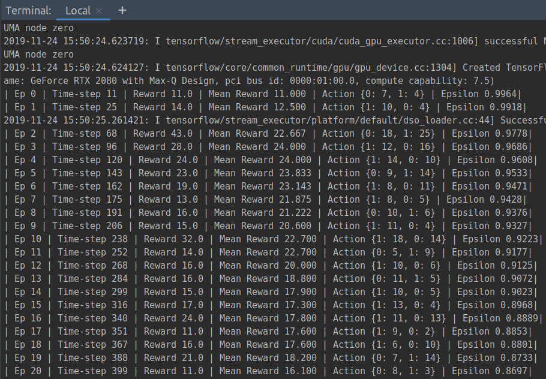
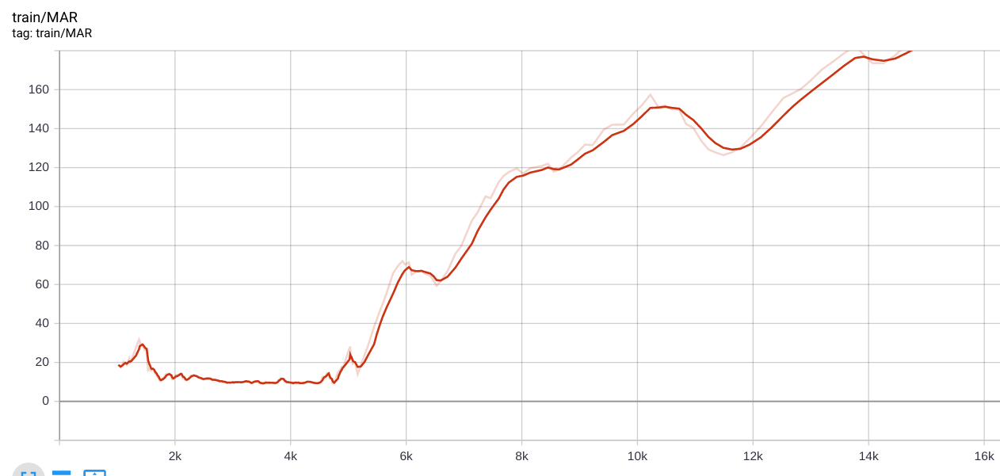
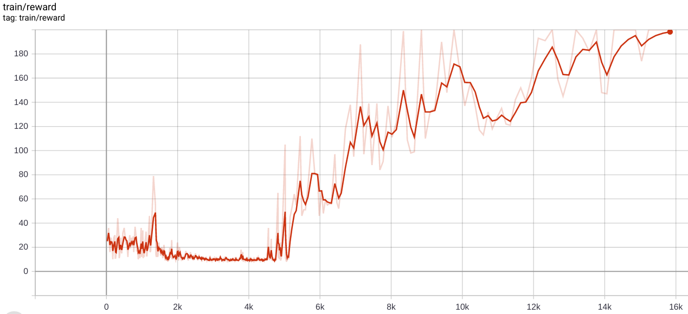

## Introduction
this is the repo for solve `CartPole-v0` in OpenAI Gym env.


## Dependencies

- TensorFlow: 2.0.0
- For more details check the `requirements.txt`


## Usage

```shell script
# make sure to set the correct python path
export PYTHONPATH=.

# run the script
python dqn_cartpole/src/main.py
```

then you'll see logs on the console.




## Result

### Result of `tf.compat.v1.train.RMSPropOptimizer`

- Mean Average of Episode Rewards over 10 Ep




- Episode Reward




### Experimental Results

- You can check all results of the experiments on **Tensorboard**

  ```shel
  tensorboard --logdir=./logs
  ```


## Insight

```python
    # === Play with some possible combinations ===
    loss_fn = tf.compat.v1.losses.mean_squared_error
    # loss_fn = tf.compat.v1.losses.huber_loss
    # optimizer = tf.optimizers.RMSprop(learning_rate=0.00025,
    #                                   decay=0.95,
    #                                   momentum=0.0,
    #                                   epsilon=0.00001,
    #                                   centered=True)
    # optimizer = tf.optimizers.Adam(learning_rate=1e-5)

    optimizer = tf.compat.v1.train.RMSPropOptimizer(learning_rate=0.00025,
                                                    decay=0.95,
                                                    momentum=0.0,
                                                    epsilon=0.00001,
                                                    centered=True)
    # optimizer = tf.compat.v1.train.AdamOptimizer(learning_rate=1e-5)

    agent = DQN(env=env,
                loss_fn=loss_fn,
                optimizer=optimizer,
                log_dir=log_dir)
    agent.rl()
```

As you can see, I have tried out many combinations of `optimizer` / `loss_fn` implemented in TensorFlow. Yet, the best one was **tf.compat.v1.train.RMSPropOptimizer**.